# 💧 Deep Learning for Groundwater Quality Assessment

### Water Quality Prediction and Classification using PyTorch

A comprehensive Deep Learning project that predicts **Water Quality Index (WQI)** and classifies groundwater quality using physicochemical water parameters collected by the **Central Pollution Control Board (CPCB), India**.

Unlike a typical predictive modeling project, this work focuses not only on achieving high accuracy but also on systematically evaluating how different Deep Learning design choices influence performance on a real-world environmental dataset.

---

## 📌 Project Overview

Groundwater quality assessment is critical for environmental monitoring, public health, and sustainable water resource management. Traditional assessment methods require extensive laboratory analysis and expert interpretation. Machine Learning and Deep Learning models can help automate this process by learning relationships between water chemistry parameters and water quality indicators.

This project addresses two predictive tasks:

### Regression

Predicting the **Water Quality Index (WQI)**

### Classification

Predicting the **Water Quality Classification**

Classes include:

* Excellent
* Good
* Poor
* Very Poor yet Drinkable
* Unsuitable for Drinking

---

## 🔄 Project Workflow

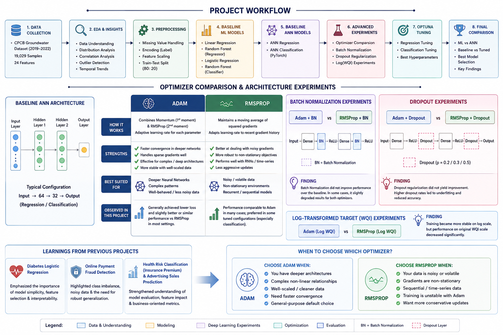

```text
Raw CPCB Groundwater Dataset
            │
            ▼
   Data Understanding
            │
            ▼
 Exploratory Data Analysis
            │
            ▼
    Data Preprocessing
            │
            ▼
 ┌──────────────────────────┐
 │ Baseline ML Models       │
 │ • Linear Regression      │
 │ • Random Forest          │
 │ • Logistic Regression    │
 └──────────────────────────┘
            │
            ▼
 ┌──────────────────────────┐
 │ Baseline ANN Models      │
 │ • ANN Regression         │
 │ • ANN Classification     │
 └──────────────────────────┘
            │
            ▼
 ┌──────────────────────────┐
 │ Optimizer Comparison     │
 │ • Adam                   │
 │ • RMSprop                │
 │ • SGD                    │
 └──────────────────────────┘
            │
            ▼
 ┌──────────────────────────┐
 │ BatchNorm Experiments    │
 │ • Adam                   │
 │ • RMSprop                │
 └──────────────────────────┘
            │
            ▼
 ┌──────────────────────────┐
 │ Dropout Experiments      │
 │ • Adam (0.2/0.3/0.5)     │
 │ • RMSprop (0.2/0.3/0.5)  │
 └──────────────────────────┘
            │
            ▼
 ┌──────────────────────────┐
 │ Log(WQI) Experiments     │
 │ • Adam                   │
 │ • RMSprop                │
 └──────────────────────────┘
            │
            ▼
 ┌──────────────────────────┐
 │ Optuna Optimization      │
 │ • Regression             │
 │ • Classification         │
 └──────────────────────────┘
            │
            ▼
 ┌──────────────────────────┐
 │ Final Model Comparison   │
 │ • ML Models              │
 │ • ANN Models             │
 │ • Tuned Models           │
 └──────────────────────────┘
            │
            ▼
        Key Findings
```

---

## 📊 Dataset Information

**Source:** Central Pollution Control Board (CPCB), India

### Dataset Statistics

* Records: 19,029
* Features: 24
* Time Period: 2019–2022

### Input Features

* pH
* Electrical Conductivity (EC)
* Carbonates (CO3)
* Bicarbonates (HCO3)
* Chlorides (Cl)
* Sulfates (SO4)
* Nitrates (NO3)
* Total Hardness (TH)
* Calcium (Ca)
* Magnesium (Mg)
* Sodium (Na)
* Potassium (K)
* Fluoride (F)
* Total Dissolved Solids (TDS)
* Latitude
* Longitude
* State
* District
* Block
* Village
* Year

### Target Variables

#### Regression Target

* Water Quality Index (WQI)

#### Classification Target

* Water Quality Classification

---

## 🔍 Exploratory Data Analysis

The project included extensive exploratory analysis covering:

* Missing value analysis
* Duplicate detection
* Water quality class distribution
* WQI distribution analysis
* Water chemistry feature analysis
* Correlation analysis
* Temporal trends (2019–2022)
* Outlier analysis

### Water Quality Class Distribution

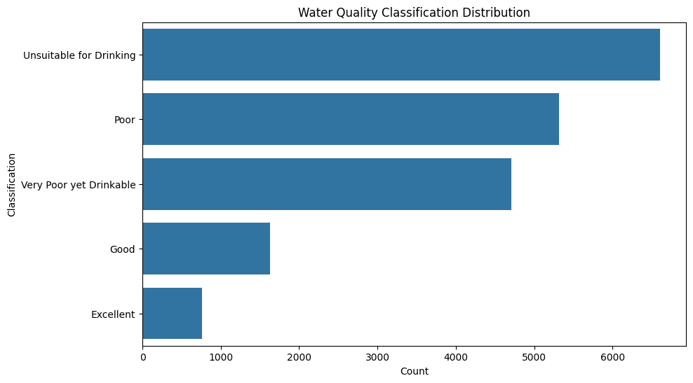

### WQI Distribution

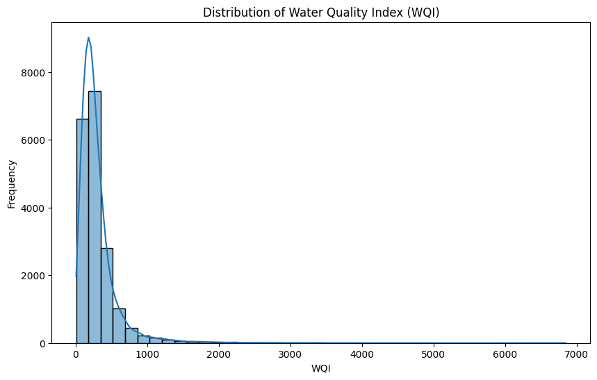

### Water Quality Analysis

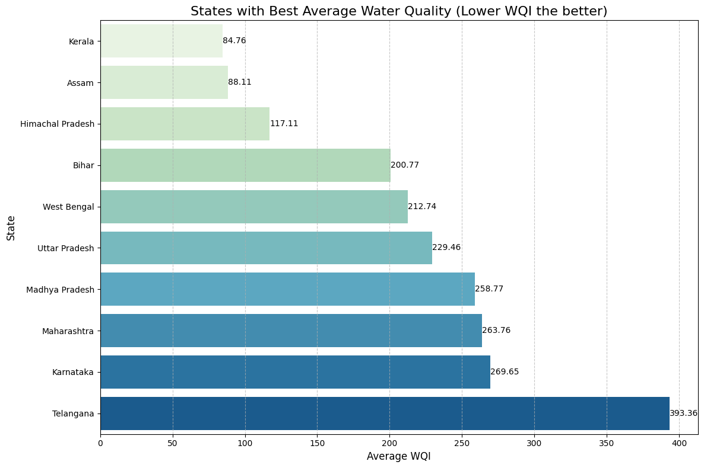

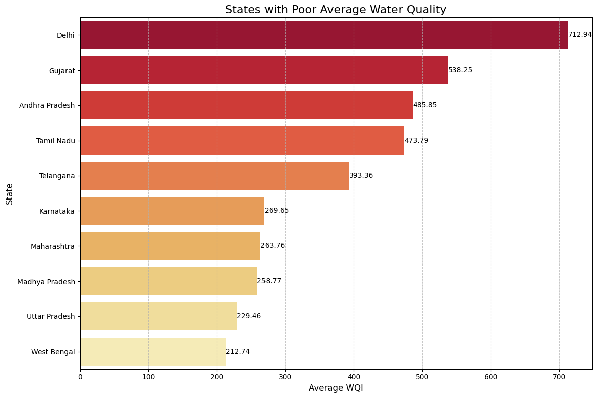

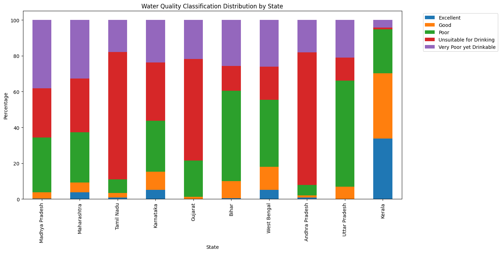

### Correlation Heatmap

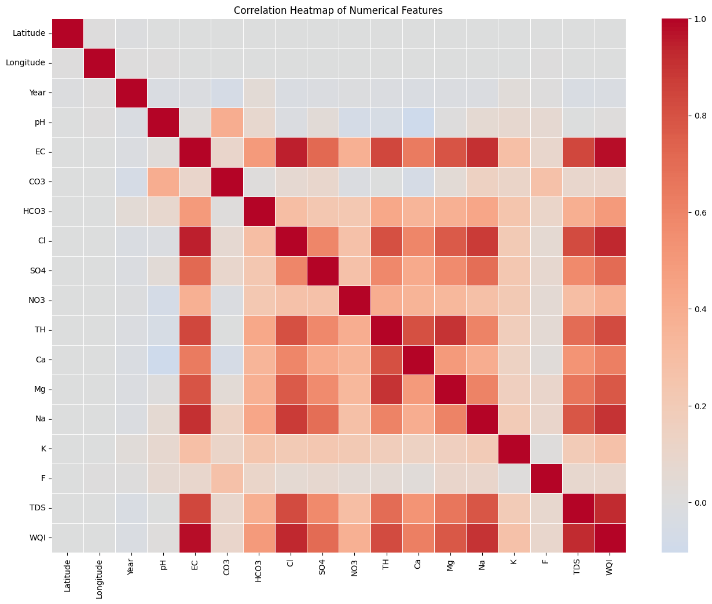


### Key Findings

| Feature | Correlation with WQI |
| ------- | -------------------- |
| EC      | 0.981                |
| Cl      | 0.932                |
| TDS     | 0.924                |
| Na      | 0.904                |
| TH      | 0.822                |

Electrical Conductivity (EC) emerged as the most influential predictor of groundwater quality.

---

## ⚙️ Data Preprocessing

The following preprocessing steps were performed:

* Missing value treatment
* Duplicate removal
* Label Encoding
* Feature Scaling using StandardScaler
* Train-Test Split (80:20)

### Correlation of Water Chemistry Parameters with WQI

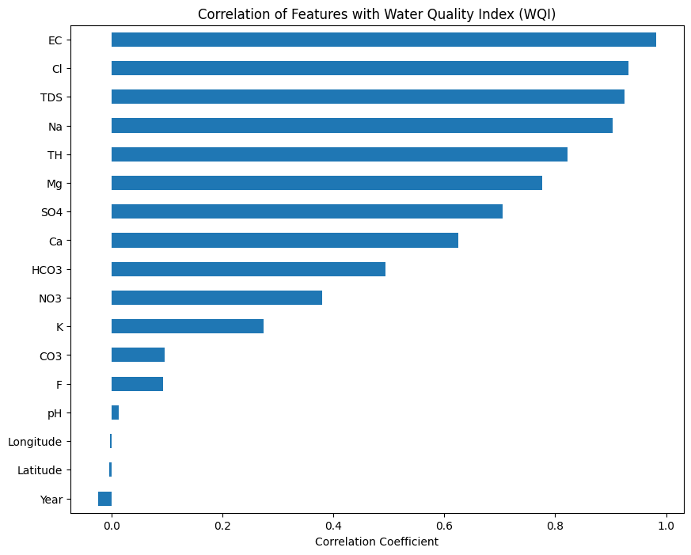
---

## 🤖 Machine Learning Baselines

### Regression Models

| Model                   | RMSE        | R² Score |
| ----------------------- | ----------- | -------- |
| Linear Regression       | 0.000000009 | 1.000000 |
| Random Forest Regressor | 18.7683     | 0.997030 |

### Classification Models

| Model                    | Accuracy | F1 Score |
| ------------------------ | -------- | -------- |
| Logistic Regression      | 0.9585   | 0.9581   |
| Random Forest Classifier | 0.9740   | 0.9740   |

---

## 🧠 Deep Learning Models

### ANN Regression

Architecture:

```text
Input Layer → 64 → 32 → Output Layer
```

#### Results

| Metric   | Value    |
| -------- | -------- |
| RMSE     | 1.3861   |
| R² Score | 0.999984 |

### ANN Training Curves Regression

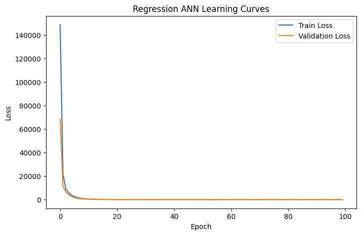

---

### ANN Classification

Architecture:

```text
Input Layer → 64 → 32 → Output Layer
```

#### Results

| Metric   | Value  |
| -------- | ------ |
| Accuracy | 0.9779 |
| F1 Score | 0.9777 |

### ANN Training Curves Classification

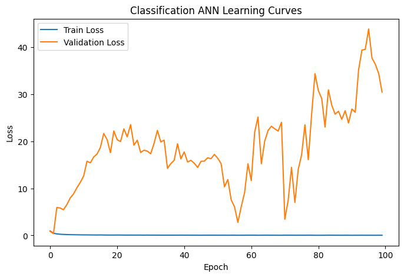

---

## 🧪 Advanced Deep Learning Experiments

A major objective of this project was to evaluate whether commonly used Deep Learning enhancements could improve model performance.

### Optimizer Comparison

Compared:

* Adam
* RMSprop
* SGD

**Finding:** Adam and RMSprop significantly outperformed SGD.

---

### Batch Normalization

Batch Normalization layers were introduced after hidden layers.

**Finding:** Performance decreased compared to the baseline ANN.

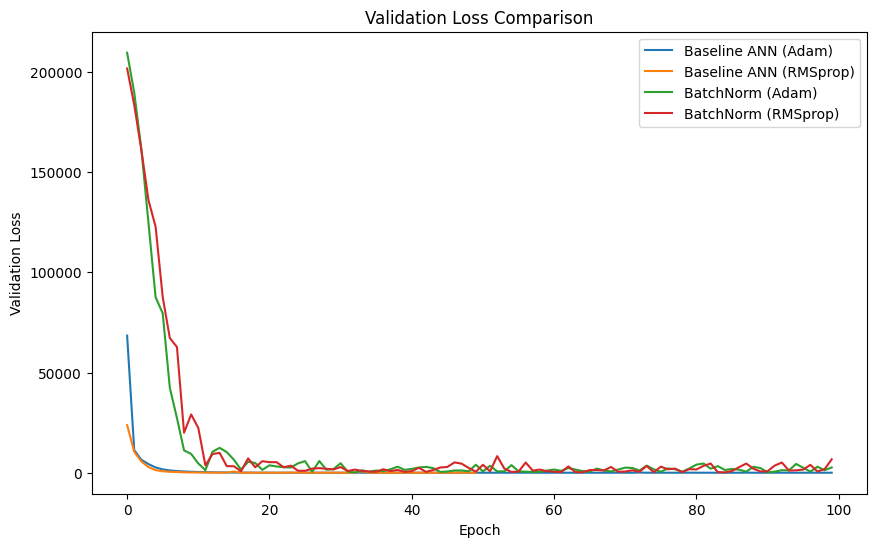

---

### Dropout Regularization

Dropout rates evaluated:

* 0.2
* 0.3
* 0.5

**Finding:** Dropout did not improve performance and excessive regularization degraded accuracy.

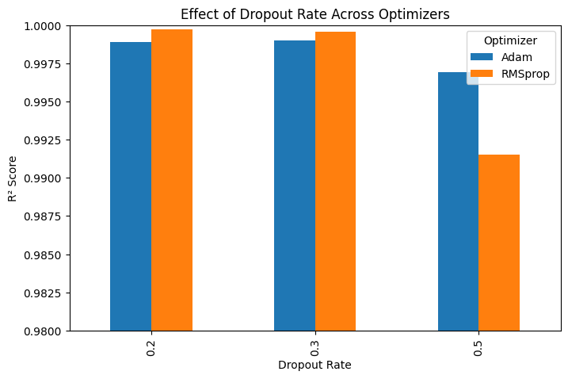

---

### Log-Transformed WQI

The highly skewed WQI distribution was transformed using a logarithmic scale.

**Finding:** Training became more stable, but predictive performance on the original WQI scale decreased significantly.

---

## 🎯 Hyperparameter Optimization using Optuna

Automated hyperparameter tuning was performed separately for regression and classification tasks.

### Regression Best Configuration

```python
{
    "hidden_dim1": 32,
    "hidden_dim2": 128,
    "learning_rate": 0.0008,
    "optimizer": "Adam",
    "batch_size": 32
}
```

### Optuna Optimization History Regression

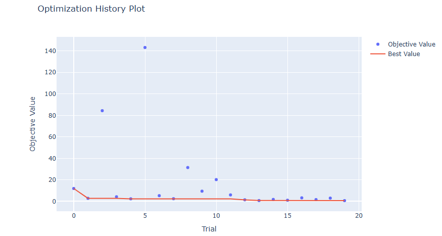


### Optuna Optimization Hyperparameter Importance Regression

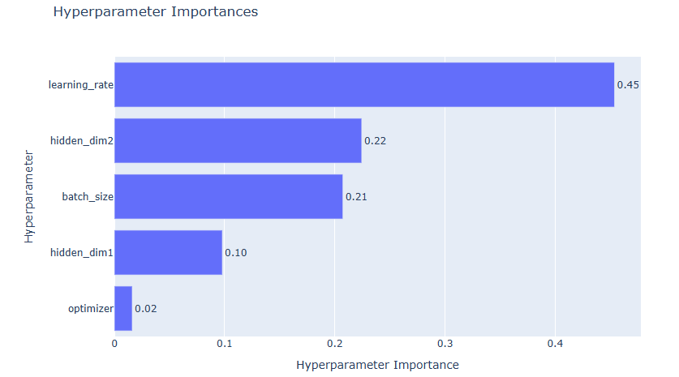


### Classification Best Configuration

```python
{
    "hidden_dim1": 32,
    "hidden_dim2": 128,
    "learning_rate": 0.0058,
    "optimizer": "RMSprop",
    "batch_size": 32
}
```

### Optuna Optimization History Classification

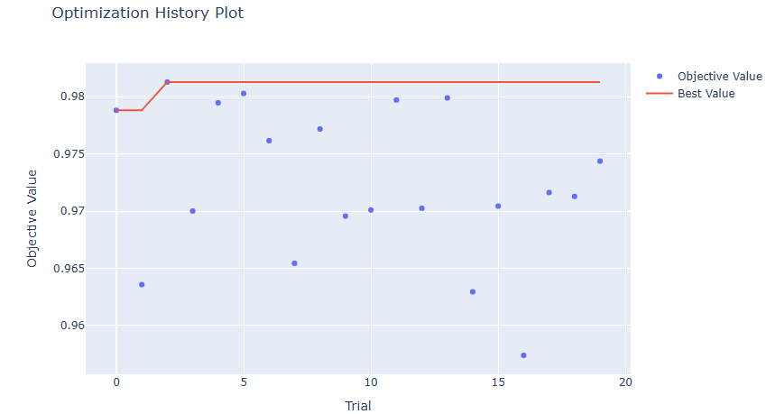


### Optuna Optimization Hyperparameter Importance Classification

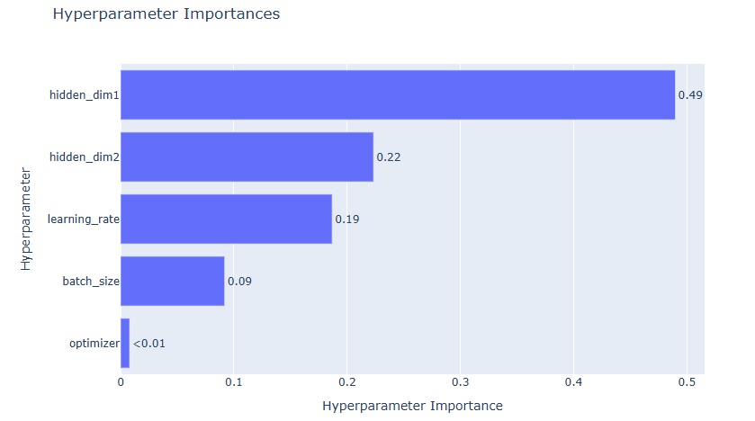

---

## 📈 Final Model Comparison

### Regression

| Model              | RMSE        | R² Score |
| ------------------ | ----------- | -------- |
| Linear Regression  | 0.000000009 | 1.000000 |
| Random Forest      | 18.7683     | 0.997030 |
| Baseline ANN       | 1.3861      | 0.999984 |
| Tuned ANN (Optuna) | 1.3245      | 0.999985 |

### Classification

| Model               | Accuracy | F1 Score |
| ------------------- | -------- | -------- |
| Logistic Regression | 0.9585   | 0.9581   |
| Random Forest       | 0.9740   | 0.9740   |
| Baseline ANN        | 0.9779   | 0.9777   |
| Tuned ANN (Optuna)  | 0.9771   | 0.9770   |


---

## 🎯 Why This Project Matters

One of the most interesting aspects of this project was the nature of the dataset itself. Exploratory analysis revealed exceptionally strong relationships between several water chemistry variables and the target Water Quality Index (WQI). For example, Electrical Conductivity (EC) exhibited a correlation greater than 0.98 with WQI, and even simple machine learning models achieved near-perfect predictive performance.

At first glance, such a dataset may appear to leave little room for advanced Deep Learning techniques to demonstrate substantial gains. However, the primary objective of this project was not merely to maximize accuracy, but to systematically investigate how different Deep Learning design choices influence model behavior and performance.

To achieve this, the project explored:

* Baseline Machine Learning models
* Baseline Artificial Neural Networks
* Optimizer comparison (Adam, RMSprop, SGD)
* Batch Normalization
* Dropout Regularization
* Log-transformed targets
* Hyperparameter optimization using Optuna
* Final model comparison and selection

Interestingly, most advanced techniques produced little or no improvement over the baseline ANN architecture. This became a valuable learning outcome in itself, demonstrating that increased model complexity does not automatically lead to better performance when the underlying dataset already contains highly informative predictive features.

The project therefore serves as a structured case study in Deep Learning experimentation, model evaluation, and evidence-based decision making rather than simply an exercise in maximizing predictive accuracy.

---

## 🎓 Key Lessons Learned

* Strong feature-target relationships can dominate model performance.
* Increased model complexity does not guarantee better results.
* Batch Normalization and Dropout are not universally beneficial for tabular datasets.
* Hyperparameter optimization may provide only marginal gains when the baseline model is already near-optimal.
* Data quality and feature informativeness often contribute more to success than architectural complexity.
* Evidence-based experimentation is more valuable than blindly applying advanced techniques.

---

## 🛠️ Technology Stack

* Python
* Pandas
* NumPy
* Matplotlib
* Seaborn
* Scikit-Learn
* PyTorch
* Optuna

---

## 📂 Repository Structure

```text
├── data/
├── notebooks/
│   └── Water_Quality_Deep_Learning.ipynb
├── images/
├── reports/
│   └── Project_Report.pdf
├── requirements.txt
└── README.md
```

---

## 🚀 Future Work

Potential extensions include:

* LSTM and Transformer-based temporal modeling
* Geospatial analysis using GIS data
* Explainable AI using SHAP and LIME
* Ensemble learning approaches
* IoT-based real-time groundwater monitoring systems
* Deployment as a web-based decision support platform

---

## 📜 License

This project was developed for educational and research purposes as part of a Deep Learning learning pathway using PyTorch.
